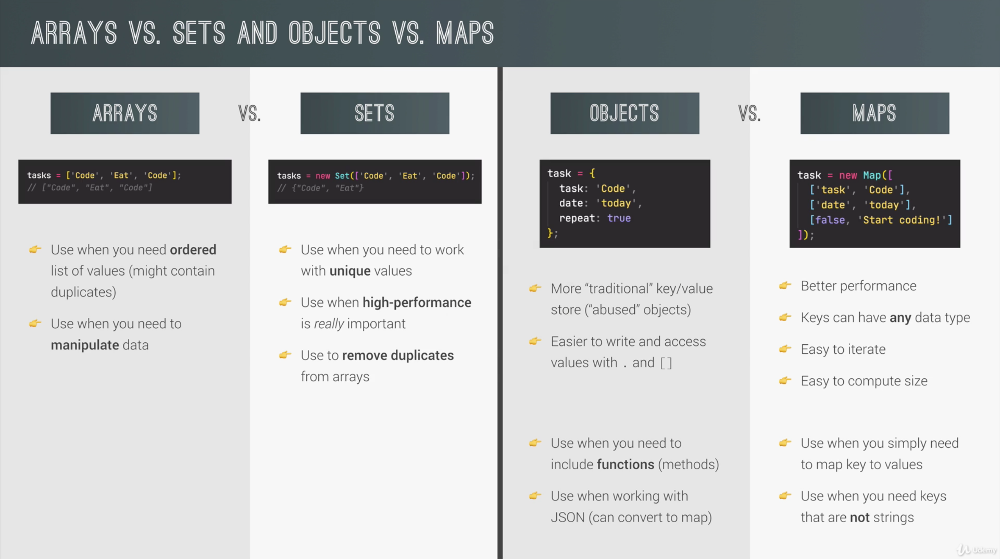

# Udemy Javascript class!

[2020.Dec.16]

# 91. Execution Contexts and The Call Stack

https://developer.mozilla.org/en-US/docs/Web/JavaScript/EventLoop

https://developer.mozilla.org/en-US/docs/Glossary/Call_stack

https://blog.sessionstack.com/

https://velog.io/@thms200/Event-Loop-%EC%9D%B4%EB%B2%A4%ED%8A%B8-%EB%A3%A8%ED%94%84

[how-does-javascript-actually-work-part-1](https://blog.sessionstack.com/how-does-javascript-actually-work-part-1-b0bacc073cf)
[Check]

# 92 Scope and the scope chain

스코프는 "변수는 어딨지?", "특정 변수를 어디에서 접근해야하지?"와 같은 질문이다.

Lexical Scoping: Scoping is controlled by placement of functions and blocks in
the code.

Scope: Space or environment in which a certain variable is declared. (for
functions as well)

Global scope: outside of any function or block.

Function scope: variables are accessible only inside function, not outside.
(also called local scope)

Block scope(ES6): Variables are accessible only inside block, HOWEVER, this only
applies to let and const variables.

Functions are also block scoped. (only in strict mode).

스코프는 부모 스코프에 있는 변수에 접근할 수 있다. current scope에 찾는 변수가없
다면, 부모 스코프로가서 변수를 찾는다. 하지만, 그 반대로는 일어나진 않는다.

## scope chain vs call stack

call stack은 함수가 호출된 순서이다.

scope chain은 함수의 호출 순서와는 관련이 없다.

# 93. Scoping in Practice

```js
function printAge() {
  if (true) {
    var millenial = true;
    const str = 'you are millenial';
    // variables are only accessible inside the block.
  }
  // console.log(str); // error
  // console.log(millenial); // true
}
printAge();
// 블락 스코프 안에 함수를 만들어도 블락 스코프 안에서만 호출할 수 있다. (strict mode에서만!)
```

자바스크립트는 가장 가까운 스코프 먼저 변수를 찾기 시작한다. 현재 스코프에 변수
가 존재한다면, 스코프체인은 필요하지 않는다.

다른 스코프에 있는 경우, 변수의 이름을 번복해도 상관이 없다!

# 94. Variable Environment: Hoisting and The TDZ

Hoisting: Makes some types of variables accessible/ usable in the code before
they are actually declared.


## Temporal Dead Zone, Let and const

TDZ: the region of the scope in which the variable is defined, but can't be used
in any way.

Why TDZ? Makes it easier to avoid and catch errors: accessing variables before
declaration is bad practice and should be avoided.

# 95. Hoisting and TDZ in Practice

```js
console.log(me); // hoisting이 일어나지만, undefined
console.log(job); //
console.log(year); // job과 마찬가지로 TDZ에 머물고 있음.

var me = 'Jonas';
let job = 'teacher';
const year = 1991;
```

```js
// Functions
console.log(addDecl(2, 3)); // 5
// console.log(addExpr(2, 3)); // addExpr가 TDZ에 있기 때문
console.log(addArrow); // var로 변경했을 땐, undefined
// console.log(addArrow(2, 3));

function addDecl(a, b) {
  return a + b;
}

const addExpr = function (a, b) {
  return a + b;
};

var addArrow = (a, b) => a + b;
```

```js
// Example
console.log(undefined);

if (!numProducts) deleteShoppingCart(); // All products deleted!
// numProducts 가 undefined 이기 때문에, 즉, false가 반환된다. 고로 deleteShoppingCart 함수가 실행된다.

var numProducts = 10;

function deleteShoppingCart() {
  console.log('All products deleted!');
}

var x = 1;
let y = 2;
const z = 3;

// window is global object!
// var로 변수를 선언하면, window 즉, 전역객체에 x 프로퍼티가 생성된다.

console.log(x === window.x); // true
console.log(y === window.y); // false
console.log(z === window.z); // false
```

# 96. The this Keyword

this keyword/variables: Special variables that is created for every
context(every function). this keyword is not **static.**


# 97. The this Keyword in Practice

브라우저 콘솔에 `console.log(this);`을 입력하면 `Window 객체`가 출력된다.

```js
const calcAgeArrow = (birthYear) => {
  console.log(2037 - birthYear);
  console.log(this);
};

calcAgeArrow(1980); // Window / lexical this keyword
// it uses the this keyword of its parent function or scope
```

```js
const jonas = {
  year: 1991,
  calcAge: function () {
    console.log(this);
    console.log(2037 - this.year);
  }
};
jonas.calcAge(); // 부모객체인 즉, owner인 jonas 객체가 나옴.
```

# 98. Regular Functions vs. Arrow Functions

- **메서드로 화살표 함수는 사용하지 않기**

```js
///////////////////////////////////////
// Regular Functions vs. Arrow Functions
// var firstName = 'Matilda';
// var를 사용하는 것은 전역객체를 만들기 때문에 꽤나 위험하다.
// var 변수를 선언하면, greet 메서드에서 undefined가 아닌 마틸다를 지칭할 것이다.
const jonas = {
  firstName: 'Jonas',
  year: 1991,
  calcAge: function () {
    // console.log(this);
    console.log(2037 - this.year);

    // Solution 1
    // const self = this; // self or that
    // const isMillenial = function () {
    //   console.log(self);
    //   console.log(self.year >= 1981 && self.year <= 1996);
    // };

    // Solution 2
    const isMillenial = () => {
      console.log(this);
      console.log(this.year >= 1981 && this.year <= 1996);
    };

    isMillenial();
  }, // 화살표 함수는 부모의 this keyword를 사용한다.
  // 따라서, this는 jonas를 가르킨다.
  greet: () => {
    console.log(this);
    console.log(`Hey ${this.firstName}`);
  }
};
jonas.greet();
// jonas.calcAge();
```

## Arguments 키워드

추가 arg를 추가하여 사용하는 것이 가능하다. 하지만, Arguments 키워드는 regular
function안에서만 존재하고, arrow function에선 존재하지 않는다.

arguments란 모든 아규먼트를 유사배열 형태로 참조하는 값이다.

하지만, ES6에서 스프레드 연산자가 추가된 뒤 쓰지 않는다.

```js
// arguments keyword
const addExpr = function (a, b) {
  console.log(arguments);
  return a + b;
};
addExpr(2, 5);
addExpr(2, 5, 8, 12);
var addArrow = (a, b) => {
  console.log(arguments);
  return a + b;
};
addArrow(2, 5, 8);
```

# 99. Primitives vs. Objects (Primitive vs. Reference Types)

```js
// Objects vs. primitives
let age = 30;
let oldAge = age;
age = 31;
console.log(age);
console.log(oldAge);
const me = {
  name: 'Jonas',
  age: 30,
};
const friend = me;
friend.age = 27;
console.log('Friend:', friend); // 'friend': {name: 'Jonas', age: 27}
console.log('Me', me); // 'Me': {name: 'Jonas', age: 27}
Primitive data types: number, string, boolean, undefined, null, symbol. (Primitive type) => Get stored in `the call stack`
Objects: object literal, arrays, functions..many more. (Reference type) => Get stored in `the memory heap`.
```

It's not true to say const are immutable. In fact, that is only true for
primitive values, but not for reference values.

# 100. Primitives vs. Objects in Practice

```js
## Object.assign

이 기술은 오리지널을 그대로 카피할 수 있게 해준다. 그러나, 오직 first level 에서만 가능하다는 문제가 존재한다. 즉, 오직 shallow copy만 가능하다.

## Manipulation the copied object with Push method

// Copying objects
const jessica2 = {
  firstName: 'Jessica',
  lastName: 'Williams',
  age: 27,
  family: ['Alice', 'Bob'],
};
const jessicaCopy = Object.assign({}, jessica2);
jessicaCopy.lastName = 'Davis';
jessicaCopy.family.push('Mary');
jessicaCopy.family.push('John');
console.log('Before marriage:', jessica2);
console.log('After marriage: ', jessicaCopy);
```

외부 라이브러리인 Lo-Dash를 통해서도 깊은 복사가 가능하다!

[2020.Dec.18]

# 103. Destructing Arrays

```js
///////////////////////////////////////
const restaurant = {
  name: 'Classico Italiano',
  location: 'Via Angelo Tavanti 23, Firenze, Italy',
  categories: ['Italian', 'Pizzeria', 'Vegetarian', 'Organic'],
  starterMenu: ['Focaccia', 'Bruschetta', 'Garlic Bread', 'Caprese Salad'],
  mainMenu: ['Pizza', 'Pasta', 'Risotto'],

  order: function (starterIndex, mainIndex) {
    return [this.starterMenu[starterIndex], this.mainMenu[mainIndex]];
  }
};

// Destructuring Arrays
const arr = [2, 3, 4];
const a = arr[0];
const b = arr[1];
const c = arr[2];
const [x, y, z] = arr;
console.log(x, y, z); // 2, 3, 4
console.log(arr); // 2, 3, 4

// How to skill a stuff that we might not even need
let [main, , secondary] = restaurant.categories;
console.log(main, secondary);

// Switching variables
// const temp = main;
// main = secondary;
// secondary = temp;
// console.log(main, secondary);

// Switching variables with destructuring
[main, secondary] = [secondary, main];
console.log(main, secondary);

// Receive 2 return values from a function
const [starter, mainCourse] = restaurant.order(2, 0);
console.log(starter, mainCourse);

// Nested destructuring
const nested = [2, 4, [5, 6]];

// const [i, , j] = nested;
const [i, , [j, k]] = nested;
console.log(i, j, k);

// Default values
// 설정하지 않으면, undefined 출력
const [p = 1, q = 1, r = 1] = [8, 9];
console.log(p, q, r);
```

# 104 Destructuring Objects

```js
const restaurant = {
  name: 'Classico Italiano',
  location: 'Via Angelo Tavanti 23, Firenze, Italy',
  categories: ['Italian', 'Pizzeria', 'Vegetarian', 'Organic'],
  starterMenu: ['Focaccia', 'Bruschetta', 'Garlic Bread', 'Caprese Salad'],
  mainMenu: ['Pizza', 'Pasta', 'Risotto'],
  openingHours: {
    thu: {
      open: 12,
      close: 22
    },
    fri: {
      open: 11,
      close: 23
    },
    sat: {
      open: 0,
      close: 24
    }
  }
};

// const { name, openingHours, categories } = restaurant;
// console.log(name, openingHours, categories);
// console.log('------------------------------------');
// console.log(restaurant); // 구조 분해 할당은 본래 객체의 데이터는 해치지 않는다.

///////////////////////////////////////
// 🤩 구조 분해 할당으로 새로운 변수이름 주기!
const {
  name: restaurantName,
  openingHours: hours,
  categories: tags
} = restaurant;

// console.log(restaurantName, hours, tags);

//// third-party-data 를 다룰 때, 사용하기 좋음!
// 디폴트 값을 지정해서 새로운 변수 이름 주기!

///////////////////////////////////////
// Default values
const { menu = [], starterMenu: starters = [] } = restaurant;
console.log(menu, starters);
// [] [ 'Focaccia', 'Bruschetta', 'Garlic Bread', 'Caprese Salad' ]
// menu는 본래 객체의 데이터에 존재하지 않기 때문에, 디폴트 값을 출력한다.

///////////////////////////////////////
// - Mutating variables
let a = 111;
let b = 999;
const obj = { a: 23, b: 7, c: 14 };

// {a, b} = obj; // SyntaxError // 자바스크립트는 컬리 브라켓을 code block으로 인식한다.

({ a, b } = obj);
// 대신에 parenthesis로 묶어주면 괜찮다!
console.log(a, b); // 23 7

///////////////////////////////////////
// - Nested Objects
const { fri } = openingHours;
console.log(fri);

const {
  fri: { open, close }
} = openingHours;
console.log(open, close);

const {
  fri: { open: o, close: c }
} = openingHours;
console.log(o, c);
```

# 105 The Spread Operator (...)

```js
///////////////////////////////////////
// The Spread Operator (...)
const arr = [7, 8, 9];
const badNewArr = [1, 2, arr[0], arr[1], arr[2]];
console.log(badNewArr); // [1, 2, 7, 8, 9];

///////////////////////////////////////
// Much better way! with Spread operator
const newArr = [1, 2, ...arr];
console.log(newArr); // [1, 2, 7, 8, 9];

console.log(...newArr); // 1, 2, 7, 8, 9 (individually!)

console.log(1, 2, 7, 8, 9);
const newMenu = [...restaurant.mainMenu, 'Gnocci'];
// 위는 이전 배열을 확장시켜서 새로운 배열을 생성하는 것이다.
console.log(newMenu); // [ 'Pizza', 'Pasta', 'Risotto', 'Gnocci' ]

// Copy array
const mainMenuCopy = [...restaurant.mainMenu];

// Join 2 arrays
const menu = [...restaurant.starterMenu, ...restaurant.mainMenu];
console.log(menu);

// The spread operator works on all so-called iterables.
// Iterables: arrays, strings, maps, sets. NOT objects
const str = 'Jonas';
const letters = [...str, ' ', 'S.'];
console.log(letters);
console.log(...str);

// console.log(`${...str} Schmedtmann`);
// 위는 출력되지 않는다.
// 스프레드 연산자는 우리가 함수로 인자를 넘겨줄 때 혹은 새로운 배열을 만들 때만 사용이 가능하기 때문이다.
```

```js
const restaurant = {
  name: 'Classico Italiano',
  location: 'Via Angelo Tavanti 23, Firenze, Italy',
  categories: ['Italian', 'Pizzeria', 'Vegetarian', 'Organic'],
  starterMenu: ['Focaccia', 'Bruschetta', 'Garlic Bread', 'Caprese Salad'],
  mainMenu: ['Pizza', 'Pasta', 'Risotto'],
  order: function (starterIndex, mainIndex) {
    return [this.starterMenu[starterIndex], this.mainMenu[mainIndex]];
  },

  orderDelivery: function ({
    starterIndex = 1,
    mainIndex = 0,
    time = '20:00',
    address
  }) {
    console.log(
      `Order received! ${this.starterMenu[starterIndex]} and ${this.mainMenu[mainIndex]} will be delivered to ${address} at ${time}`
    );
  },

  orderPasta: function (ing1, ing2, ing3) {
    console.log(
      `Here is your declicious pasta with ${ing1}, ${ing2} and ${ing3}`
    );
  }
};

// Real-world example
const ingredients = [
  // prompt("Let's make pasta! Ingredient 1?"),
  // prompt('Ingredient 2?'),
  // prompt('Ingredient 3'),
];

console.log(ingredients);

restaurant.orderPasta(ingredients[0], ingredients[1], ingredients[2]);

restaurant.orderPasta(...ingredients);

// since ES 2018, 스프레드 연산자가 object에 적용이 가능하다.
// Objects
const newRestaurant = { foundedIn: 1998, ...restaurant, founder: 'Guiseppe' };

console.log(newRestaurant);

const restaurantCopy = { ...restaurant };
restaurantCopy.name = 'Ristorante Roma';

console.log(restaurantCopy.name);
console.log(restaurant.name);
```

# 106 Rest Pattern and Parameters

```js
///////////////////////////////////////
// Rest Pattern and Parameters
// 1) Destructuring
// - SPREAD, because on RIGHT side of =
const arr = [1, 2, ...[3, 4]];

// - REST, because on LEFT side of =
const [a, b, ...others] = [1, 2, 3, 4, 5];
console.log(a, b, others); // 1 2 [3, 4, 5]

const [pizza, , risotto, ...otherFood] = [
  ...restaurant.mainMenu,
  ...restaurant.starterMenu
];
console.log(pizza, risotto, otherFood);

// Objects
const { sat, ...weekdays } = restaurant.openingHours;
console.log(weekdays);

// 2) Functions
const add = function (...numbers) {
  let sum = 0;
  for (let i = 0; i < numbers.length; i++) sum += numbers[i];
  console.log(sum);
};

add(2, 3);
add(5, 3, 7, 2);
add(8, 2, 5, 3, 2, 1, 4);
const x = [23, 5, 7];
add(...x);

const restaurant = {
  name: 'Classico Italiano',
  location: 'Via Angelo Tavanti 23, Firenze, Italy',
  categories: ['Italian', 'Pizzeria', 'Vegetarian', 'Organic'],
  starterMenu: ['Focaccia', 'Bruschetta', 'Garlic Bread', 'Caprese Salad'],
  mainMenu: ['Pizza', 'Pasta', 'Risotto'],
  weekdays: ['mon', 'tue', 'wed', 'thu', 'fri', 'sat', 'sun'],
  openingHours: {
    [weekdays[3]]: {
      open: 12,
      close: 22
    },
    [weekdays[4]]: {
      open: 11,
      close: 23
    },
    [weekdays[5]]: {
      open: 0, // Open 24 hours
      close: 24
    }
  },
  order: function (starterIndex, mainIndex) {
    return [this.starterMenu[starterIndex], this.mainMenu[mainIndex]];
  },

  orderDelivery: function ({
    starterIndex = 1,
    mainIndex = 0,
    time = '20:00',
    address
  }) {
    console.log(
      `Order received! ${this.starterMenu[starterIndex]} and ${this.mainMenu[mainIndex]} will be delivered to ${address} at ${time}`
    );
  },

  orderPasta: function (ing1, ing2, ing3) {
    console.log(
      `Here is your declicious pasta with ${ing1}, ${ing2} and ${ing3}`
    );
  },

  orderPizza: function (mainIngredient, ...otherIngredients) {
    console.log(mainIngredient);
    console.log(otherIngredients);
  }
};

restaurant.orderPizza('mushrooms', 'onion', 'olives', 'spinach');
restaurant.orderPizza('mushrooms');
///////////////////////////////////////
```

# 107. Short Circuiting (&& and ||)

```js
///////////////////////////////////////
// Short Circuiting (&& and ||)
console.log('---- OR ----');
// Use ANY data type, return ANY data type, short-circuiting (truthy만 평가!)
console.log(3 || 'Jonas'); // 3
console.log('' || 'Jonas'); // 'Jonas'
console.log(true || 0); // true
console.log(undefined || null); // null
// undefined 는 falsy value!
// null 도 falsy value! Short Circuiting이 없다! 따라서 두번째 값 반환

console.log(undefined || 0 || '' || 'Hello' || 23 || null); // 'Hello' - first truthy value

restaurant.numGuests = 0;
const guests1 = restaurant.numGuests ? restaurant.numGuests : 10;
console.log(guests1); // 10

const guests2 = restaurant.numGuests || 10;
console.log(guests2); // 10
console.log('---- AND ----');
// When the first value is falsy, then returns that falsy value.
// When it is truthy, the last value returns.
console.log(0 && 'Jonas'); // 0
console.log(7 && 'Jonas'); // 'Jonas'
console.log('Hello' && 23 && null && 'jonas'); // null

// if it is truth value, the evaluation continues.
// And operator will return the first falsy value or the last value if all of them are truthy.

// Practical example
if (restaurant.orderPizza) {
  restaurant.orderPizza('mushrooms', 'spinach');
}
restaurant.orderPizza && restaurant.orderPizza('mushrooms', 'spinach');

0 && console.log('Order Pizza'); // Nothing happened
1 && console.log('Order Pizza'); // Order Pizza
///////////////////////////////////////
```

[2020.Dec.19]

# 108. The Nullish Coalescing Operator (??)

```js
///////////////////////////////////////
// The Nullish Coalescing Operator
restaurant.numGuests = 0;
const guests = restaurant.numGuests || 10;
console.log(guests);
// Nullish: null and undefined (NOT 0 or '')
const guestCorrect = restaurant.numGuests ?? 10;
console.log(guestCorrect);
///////////////////////////////////////
```

[2020.Dec.20]

# 109. Coding Challenge #1

```js
/* 
We're building a football betting app (soccer for my American friends 😅)!
Suppose we get data from a web service about a certain game (below). In this challenge we're gonna work with the data. So here are your tasks:

1. Create one player array for each team (variables 'players1' and 'players2') ✅

2. The first player in any player array is the goalkeeper and the others are field players. ✅

For Bayern Munich (team 1) create one variable ('gk') with the goalkeeper's name, ✅

and one array ('fieldPlayers') with all the remaining 10 field players  ✅

3. Create an array 'allPlayers' containing all players of both teams (22 players) ✅

4. During the game, Bayern Munich (team 1) used 3 substitute players. ✅

So create a new array ('players1Final') containing all the original team1 players plus 'Thiago', 'Coutinho' and 'Perisic' ✅

5. Based on the game.odds object, create one variable for each odd (called 'team1', 'draw' and 'team2')

6. Write a function ('printGoals') that receives an arbitrary number of player names (NOT an array) and prints each of them to the console, 

along with the number of goals that were scored in total (number of player names passed in)

7. The team with the lower odd is more likely to win. Print to the console which team is more likely to win, WITHOUT using an if/else statement or the ternary operator.

TEST DATA FOR 6: Use players 'Davies', 'Muller', 'Lewandowski' and 'Kimmich'. Then, call the function again with players from game.scored

GOOD LUCK 😀
*/

const game = {
  team1: 'Bayern Munich',
  team2: 'Borrussia Dortmund',
  players: [
    [
      'Neuer',
      'Pavard',
      'Martinez',
      'Alaba',
      'Davies',
      'Kimmich',
      'Goretzka',
      'Coman',
      'Muller',
      'Gnarby',
      'Lewandowski'
    ],
    [
      'Burki',
      'Schulz',
      'Hummels',
      'Akanji',
      'Hakimi',
      'Weigl',
      'Witsel',
      'Hazard',
      'Brandt',
      'Sancho',
      'Gotze'
    ]
  ],
  score: '4:0',
  scored: ['Lewandowski', 'Gnarby', 'Lewandowski', 'Hummels'],
  date: 'Nov 9th, 2037',
  odds: {
    team1: 1.33,
    x: 3.25,
    team2: 6.5
  }
};

const [players1, players2] = game.players;

//console.log(players1, players2);

const [goalkeeper, ...fieldPlayers] = players1;
// console.log(goalkeeper, fieldPlayers);

const allPlayers = [players1, players2];
// console.log(allPlayers);

const players1Final = [...players1, 'Thiago', 'Coutinho', 'Perisic'];
// console.log(players1Final);

// const { team1, x: draw, team2 } = { ...game.odds };
// console.log(team1, draw, team2);

const {
  odds: { team1, x: draw, team2 }
} = game;
console.log(team1, draw, team2);

// 6. Write a function ('printGoals') that receives an arbitrary number of player names (NOT an array) and prints each of them to the console,

// along with the number of goals that were scored in total (number of player names passed in)

// 6.
const printGoals = function (...players) {
  console.log(players);
  console.log(`${players.length} goals were scored`);
};
printGoals('Davies', 'Muller', 'Lewandowski', 'Kimmich');
// printGoals('Davies', 'Muller');
// printGoals(game.scored);
// printGoals(...game.scored);

// 7.
team1 < team2 && console.log('Team 1 is more likely to win');
team1 > team2 && console.log('Team 2 is more likely to win');
```

# 110. Looping Arrays: The for-of Loop

```js
const restaurant = {
  name: 'Classico Italiano',
  location: 'Via Angelo Tavanti 23, Firenze, Italy',
  categories: ['Italian', 'Pizzeria', 'Vegetarian', 'Organic'],
  starterMenu: ['Focaccia', 'Bruschetta', 'Garlic Bread', 'Caprese Salad'],
  mainMenu: ['Pizza', 'Pasta', 'Risotto'],

  order: function (starterIndex, mainIndex) {
    return [this.starterMenu[starterIndex], this.mainMenu[mainIndex]];
  },

  orderDelivery: function ({
    starterIndex = 1,
    mainIndex = 0,
    time = '20:00',
    address
  }) {
    console.log(
      `Order received! ${this.starterMenu[starterIndex]} and ${this.mainMenu[mainIndex]} will be delivered to ${address} at ${time}`
    );
  },

  orderPasta: function (ing1, ing2, ing3) {
    console.log(
      `Here is your declicious pasta with ${ing1}, ${ing2} and ${ing3}`
    );
  }
};

// The for-of Loop
const menu = [...restaurant.starterMenu, ...restaurant.mainMenu];
// for (const item of menu) console.log(item); // individually log into console

// for (const item of menu.entries()) {
//   //   console.log(item); // individually log with array number into console
//   //   console.log(`${item[0] + 1}: ${item[1]}`);

// }

// console.log(menu.entries()); // Object [Array Iterator] {}

// console.log([...menu.entries()]);

for (const [i, el] of menu.entries()) {
  console.log(`${i + 1}: ${el}`);
}
```

# 111. Enhanced Object Literals

```js
// ES6 computing property name
const weekdays = ['mon', 'tue', 'wed', 'thu', 'fri', 'sat', 'sun'];
const openingHours = {
  [weekdays[3]]: {
    open: 12,
    close: 22
  },
  [weekdays[4]]: {
    open: 11,
    close: 23
  },
  [weekdays[5]]: {
    open: 0, // Open 24 hours
    close: 24
  }
};

const restaurant = {
  name: 'Classico Italiano',
  location: 'Via Angelo Tavanti 23, Firenze, Italy',
  categories: ['Italian', 'Pizzeria', 'Vegetarian', 'Organic'],
  starterMenu: ['Focaccia', 'Bruschetta', 'Garlic Bread', 'Caprese Salad'],
  mainMenu: ['Pizza', 'Pasta', 'Risotto'],

  // Before ES6
  openingHours: openingHours,

  // ES6 enhanced object literals
  openingHours,

  // ES6 new method syntax
  order(starterIndex, mainIndex) {
    return [this.starterMenu[starterIndex], this.mainMenu[mainIndex]];
  },

  orderDelivery({ starterIndex = 1, mainIndex = 0, time = '20:00', address }) {
    console.log(
      `Order received! ${this.starterMenu[starterIndex]} and ${this.mainMenu[mainIndex]} will be delivered to ${address} at ${time}`
    );
  },

  orderPasta(ing1, ing2, ing3) {
    console.log(
      `Here is your declicious pasta with ${ing1}, ${ing2} and ${ing3}`
    );
  },

  orderPizza(mainIngredient, ...otherIngredients) {
    console.log(mainIngredient);
    console.log(otherIngredients);
  }
};
```

# 112. Optional Chaining (.?)

```js
///////////////////////////////////////
// Optional Chaining

if (restaurant.openingHours && restaurant.openingHours.mon)
  // check if it exists
  console.log(restaurant.openingHours.mon.open);
// console.log(restaurant.openingHours.mon.open); // undefined

// WITH optional chaining
// Before question mark, property exists, the next property will be read. If the next property doesn't exist, then undefined will be returned.
// NOT null, undefined.
console.log(restaurant.openingHours.mon?.open); // undefined
console.log(restaurant.openingHours?.mon?.open); // prevent error

// Example
const days = ['mon', 'tue', 'wed', 'thu', 'fri', 'sat', 'sun'];
for (const day of days) {
  // if we want to use a variable name as the property name, basically, we need to use the brackets notation.
  // const open = restaurant.openingHours[day]?.open || 'closed';
  // saturday 가 안 뜸. 0는 falsy value이기 때문!
  const open = restaurant.openingHours[day]?.open ?? 'closed';
  console.log(`On ${day}, we open at ${open}`);
}

// Methods
console.log(restaurant.order?.(0, 1) ?? 'Method does not exist');
console.log(restaurant.orderRisotto?.(0, 1) ?? 'Method does not exist');

// Arrays
const users = [{ name: 'Jonas', email: 'hello@jonas.io' }];
// const users = [];
console.log(users[0]?.name ?? 'User array empty');

if (users.length > 0) console.log(users[0].name);
else console.log('user array empty');

///////////////////////////////////////
```

# 113. Looping Objects: Object Keys, Values, and Entries

```js
///////////////////////////////////////
// Looping Objects: Object Keys, Values, and Entries

// Property NAMES
for (const day of Object.keys(openingHours)) {
  console.log(day); // thu, fri, sat
}

const properties = Object.keys(openingHours); // ['thu', 'fri', 'sat'];
console.log(properties);

let openStr = `We are open on ${properties.length} days: `;

for (const day of properties) {
  openStr += `${day}, `;
}
console.log(openStr);

// Property VALUES
const values = Object.values(openingHours);
console.log(values);

/*
[
  { open: 12, close: 22 },
  { open: 11, close: 23 },
  { open: 0, close: 24 }
]
*/

// Entire object
// object 랑 array랑 방법이 다르기 때문에 주의!

const entries = Object.entries(openingHours);
// console.log(entries);
// the value needs destructing because the value itself is also an object.
// [key, value]
for (const [day, { open, close }] of entries) {
  console.log(`On ${day} we open at ${open} and close at ${close}`);
}
```

# 114. Coding Challenge #2

```js
// Coding Challenge #2

/* 
Let's continue with our football betting app!
1. Loop over the game.scored array and print each player name to the console,
 along with the goal number (Example: "Goal 1: Lewandowski")

2. Use a loop to calculate the average odd and
 log it to the console 
 (We already studied how to calculate averages, you can go check if you don't remember)

3. Print the 3 odds to the console, but in a nice formatted way, exaclty like this:
      Odd of victory Bayern Munich: 1.33
      Odd of draw: 3.25
      Odd of victory Borrussia Dortmund: 6.5

Get the team names directly from the game object, don't hardcode them (except for "draw"). HINT: Note how the odds and the game objects have the same property names 😉
BONUS: Create an object called 'scorers' which contains the names of the players who scored as properties, and the number of goals as the value. In this game, it will look like this:
      {
        Gnarby: 1,
        Hummels: 1,
        Lewandowski: 2
      }
GOOD LUCK 😀
*/
```

```js
// 1.
for (const [i, player] of game.scored.entries())
  console.log(`Goal ${i + 1}: ${player}`);
// 2.
const odds = Object.values(game.odds);
let average = 0;
for (const odd of odds) average += odd;
average /= odds.length;
console.log(average);
// 3.
for (const [team, odd] of Object.entries(game.odds)) {
  const teamStr = team === 'x' ? 'draw' : `victory ${game[team]}`;
  console.log(`Odd of ${teamStr} ${odd}`);
}
// Odd of victory Bayern Munich: 1.33
// Odd of draw: 3.25
// Odd of victory Borrussia Dortmund: 6.5
// BONUS
// So the solution is to loop over the array, and add the array elements as object properties, and then increase the count as we encounter a new occurence of a certain element
const scorers = {};
for (const player of game.scored) {
  scorers[player] ? scorers[player]++ : (scorers[player] = 1);
}
```

[객체 기본](https://developer.mozilla.org/ko/docs/Learn/JavaScript/Objects/Basics)

# 115. Sets

```js
// Sets
const ordersSet = new Set([
  'Pasta',
  'Pizza',
  'Pizza',
  'Risotto',
  'Pasta',
  'Pizza',
]);

console.log(ordersSet); // 중복은 제외
console.log(new Set('Jonas')); // 5개의 각각의 글자 출력
console.log(new Set()); // set could be empty
console.log(ordersSet.size); // not length
console.log(ordersSet.has('Pizza')); // check if it is in there
console.log(ordersSet.has('Bread'));
console.log(ordersSet[0]); // undefined
// In sets, there are no indexes.
ordersSet.add('Garlic Bread');
ordersSet.add('Garlic Bread');
ordersSet.delete('Risotto');
// ordersSet.clear(); // clear everything in the set
console.log(ordersSet);
// sets are iterables. we can loop sets!
for (const order of ordersSet) console.log(order);

// Example
const staff = ['Waiter', 'Chef', 'Waiter', 'Manager', 'Chef', 'Waiter'];
const staffUnique = new Set(staff); // set으로 출력
const staffUnique = [...new Set(staff)]; // 새로운 배열로 출력
console.log(staffUnique);
// 우리가 얼마나 많이 고유 아이템을 가지고 있는지 알고싶다면!
console.log(
  new Set(['Waiter', 'Chef', 'Waiter', 'Manager', 'Chef', 'Waiter']).size
);
// see how many different letters there
console.log(new Set('jonasschmedtmann').size);
*/
```

# 116. Maps: Fundamentals

```js
///////////////////////////////////////
// Maps: Fundamentals
const rest = new Map();
rest.set('name', 'Classico Italiano');
rest.set(1, 'Firenze, Italy');
console.log(rest.set(2, 'Lisbon, Portugal'));

// set method returns new set, allows us to chain the set method like this.

// chain next set!
rest
  .set('categories', ['Italian', 'Pizzeria', 'Vegetarian', 'Organic'])
  .set('open', 11)
  .set('close', 23)
  .set(true, 'We are open :D')
  .set(false, 'We are closed :(');

console.log(rest.get('name'));
console.log(rest.get(true));
console.log(rest.get(1));

const time = 8;
console.log(rest.get(time > rest.get('open') && time < rest.get('close'))); // Not readable :(

console.log(rest.has('categories'));
rest.delete(2); // Key를 기반으로 지운다. // Not encouraged

// rest.clear();
const arr = [1, 2];
rest.set(arr, 'Test');
// rest.set([1, 2], 'test'); // ❶
// console.log([1, 2]); // ❶에 있는 [1, 2]의 메모리 주소가 다르기 때문에 다른 값이다.

// html element도 선택가능!
rest.set(document.querySelector('h1'), 'Heading');
console.log(rest);
console.log(rest.size);
console.log(rest.get(arr));
```

# 117 Maps: Iteration

```js
///////////////////////////////////////
// Maps: Iteration
const question = new Map([
  ['question', 'What is the best programming language in the world?'],
  [1, 'C'],
  [2, 'Java'],
  [3, 'JavaScript'],
  ['correct', 3],
  [true, 'Correct 🎉'],
  [false, 'Try again!']
]);
console.log(question);
// Convert object to map
console.log(Object.entries(openingHours));
const hoursMap = new Map(Object.entries(openingHours));
console.log(hoursMap);
// Quiz app
console.log(question.get('question'));
for (const [key, value] of question) {
  if (typeof key === 'number') console.log(`Answer ${key}: ${value}`);
}
// const answer = Number(prompt('Your answer'));
const answer = 3;
console.log(answer);
console.log(question.get(question.get('correct') === answer));
// Convert map to array
console.log([...question]);
// console.log(question.entries());
console.log([...question.keys()]);
console.log([...question.values()]);
```

# 118. Summary: Which Data Structure to Use?



# 119. Coding Challenge #3

```js
///////////////////////////////////////
// Coding Challenge #3

/*
Let's continue with our football betting app! This time, we have a map with a log of the events that happened during the game. The values are the events themselves, and the keys are the minutes in which each event happened (a football game has 90 minutes plus some extra time).
1. Create an array 'events' of the different game events that happened (no duplicates)
2. After the game has finished, is was found that the yellow card from minute 64 was unfair. So remove this event from the game events log.
3. Print the following string to the console: "An event happened, on average, every 9 minutes" (keep in mind that a game has 90 minutes)
4. Loop over the events and log them to the console, marking whether it's in the first half or second half (after 45 min) of the game, like this:
      [FIRST HALF] 17: ⚽️ GOAL
GOOD LUCK 😀
*/

const gameEvents = new Map([
  [17, '⚽️ GOAL'],
  [36, '🔁 Substitution'],
  [47, '⚽️ GOAL'],
  [61, '🔁 Substitution'],
  [64, '🔶 Yellow card'],
  [69, '🔴 Red card'],
  [70, '🔁 Substitution'],
  [72, '🔁 Substitution'],
  [76, '⚽️ GOAL'],
  [80, '⚽️ GOAL'],
  [92, '🔶 Yellow card']
]);
```

# 120. Working With Strings - Part 1

```js
///////////////////////////////////////
// Working With Strings - Part 1
const airline = 'TAP Air Portugal';
const plane = 'A320';

console.log(plane[0]); // A
console.log(plane[1]); // 3
console.log(plane[2]); // 2

console.log('B737'[0]); // B

console.log(airline.length);
console.log('B737'.length);

console.log(airline.indexOf('r')); // 6
console.log(airline.lastIndexOf('r')); // 10
console.log(airline.indexOf('portugal')); // case sensitive

console.log(airline.slice(4)); // 부분을 반환. 마지막 숫자는 포함이 되지 않는다. 숫자의 바로 직전 스트링만!
console.log(airline.slice(4, 7));
console.log(airline.slice(0, airline.indexOf(' ')));
console.log(airline.slice(airline.lastIndexOf(' ') + 1));
console.log(airline.slice(-2));
console.log(airline.slice(1, -1));
const checkMiddleSeat = function (seat) {
  // B and E are middle seats
  const s = seat.slice(-1);
  if (s === 'B' || s === 'E') console.log('You got the middle seat 😬');
  else console.log('You got lucky 😎');
};
checkMiddleSeat('11B');
checkMiddleSeat('23C');
checkMiddleSeat('3E');
console.log(new String('jonas'));
console.log(typeof new String('jonas'));
console.log(typeof new String('jonas').slice(1));
*/

```
